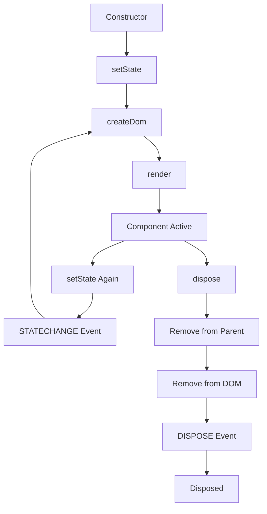

## Overview

The `Component` class is the foundation of Closure Next's component system. It extends `EventTarget` to provide event handling capabilities and implements a reactive architecture with state management, hierarchical component relationships, and lifecycle management.

## Class Definition

```typescript
import { Component } from '@closure/core';
import { DOMHelper } from '@closure/core';

class Component extends EventTarget implements ComponentInterface {
  protected domHelper: DOMHelper;
  protected element: HTMLElement | null;
  protected id: string;
  protected parent: ComponentInterface | null;
  protected children: Set<ComponentInterface>;
  protected state: ComponentState;
}
```

## Constructor

```typescript
new Component(domHelper: DOMHelper)
```

<ParamField path="domHelper" type="DOMHelper" required>
  DOMHelper instance for managing DOM operations
</ParamField>

### Example

```typescript
import { Component, DOMHelper } from '@closure/core';

const domHelper = new DOMHelper();
const component = new Component(domHelper);
```

## Identity Methods

### getId()

Returns the component's unique identifier.

```typescript
getId(): string
```

**Returns:** The component's ID string

### setId()

Sets the component's unique identifier and updates the DOM element's ID.

```typescript
setId(id: string): void
```

<ParamField path="id" type="string" required>
  Unique identifier for the component
</ParamField>

<Note>
Calling `setId()` will automatically update the `id` attribute on both the component's element and its parent node.
</Note>

### Example

```typescript
const component = new Component(domHelper);
component.setId('my-component');
console.log(component.getId()); // 'my-component'
```

## DOM Methods

### getElement()

Returns the component's root DOM element.

```typescript
getElement(): HTMLElement | null
```

**Returns:** The component's root element or `null` if not yet created

### createDom()

Creates the component's DOM structure. This is a protected method typically overridden in subclasses.

```typescript
protected async createDom(): Promise<void>
```

The default implementation creates a simple `div` element. Override this method to create custom DOM structures.

### Example

```typescript
class CustomComponent extends Component {
  protected async createDom(): Promise<void> {
    this.element = this.domHelper.createElement('button');
    this.element.textContent = 'Click me';
    if (this.id) {
      this.element.id = this.id;
    }
  }
}
```

## Hierarchy Methods

### addChild()

Adds a child component to this component.

```typescript
addChild(child: ComponentInterface): void
```

<ParamField path="child" type="ComponentInterface" required>
  The component to add as a child
</ParamField>

### removeChild()

Removes a child component from this component.

```typescript
removeChild(child: ComponentInterface): void
```

<ParamField path="child" type="ComponentInterface" required>
  The component to remove
</ParamField>

### getParent()

Returns the parent component.

```typescript
getParent(): ComponentInterface | null
```

**Returns:** The parent component or `null` if this is a root component

### getChildren()

Returns an array of all child components.

```typescript
getChildren(): ComponentInterface[]
```

**Returns:** Array of child components

### Example

```typescript
const parent = new Component(domHelper);
const child1 = new Component(domHelper);
const child2 = new Component(domHelper);

parent.addChild(child1);
parent.addChild(child2);

console.log(parent.getChildren().length); // 2
console.log(child1.getParent() === parent); // true
```

## State Management

### getState()

Returns a copy of the component's current state.

```typescript
getState(): ComponentState
```

**Returns:** A shallow copy of the component's state object

### setState()

Updates the component's state and triggers a re-render if the state has changed.

```typescript
async setState(state: ComponentState): Promise<void>
```

<ParamField path="state" type="ComponentState" required>
  Object containing state properties to merge with current state
</ParamField>

<Note>
`setState()` performs a shallow merge with the existing state. Only changed state values will trigger a re-render.
</Note>

### State Change Behavior

1. Merges new state with existing state
2. Compares old and new state using JSON serialization
3. If state changed:
   - Emits `STATECHANGE` event with new state
   - Recreates DOM via `createDom()`
   - Re-renders in parent container

### Example

```typescript
class Counter extends Component {
  constructor(domHelper: DOMHelper) {
    super(domHelper);
    this.setState({ count: 0 });
  }

  protected async createDom(): Promise<void> {
    this.element = this.domHelper.createElement('div');
    const state = this.getState();
    this.element.textContent = `Count: ${state.count}`;
  }

  async increment(): Promise<void> {
    const { count } = this.getState();
    await this.setState({ count: count + 1 }); // Triggers re-render
  }
}
```

## Rendering Methods

### render()

Renders the component into a container element.

```typescript
async render(container: HTMLElement): Promise<void>
```

<ParamField path="container" type="HTMLElement" required>
  The DOM element to render the component into
</ParamField>

**Behavior:**
- Calls `createDom()` if element doesn't exist
- Removes component from old parent if necessary
- Appends element to new container
- Updates element and container IDs
- Recursively renders all child components
- Emits `STATECHANGE` event after rendering

### renderToString()

Renders the component to an HTML string for server-side rendering.

```typescript
async renderToString(): Promise<string>
```

**Returns:** HTML string representation of the component

### hydrate()

Hydrates a server-rendered component on the client side.

```typescript
async hydrate(container?: HTMLElement): Promise<void>
```

<ParamField path="container" type="HTMLElement">
  Optional container element. If provided, uses the first child element. Otherwise, finds element by component ID.
</ParamField>

### Example

<Tabs>
  <Tab title="Client-Side Rendering">
    ```typescript
    const component = new Component(domHelper);
    component.setId('app');
    
    const container = document.getElementById('root');
    await component.render(container);
    ```
  </Tab>
  
  <Tab title="Server-Side Rendering">
    ```typescript
    // Server
    const component = new Component(domHelper);
    const html = await component.renderToString();
    // Send HTML to client
    
    // Client
    const component = new Component(domHelper);
    component.setId('app');
    await component.hydrate();
    ```
  </Tab>
</Tabs>

## Lifecycle Management

### dispose()

Cleans up the component and releases all resources.

```typescript
dispose(): void
```

**Behavior:**
1. Returns early if already disposed
2. Recursively disposes all child components
3. Clears children set
4. Removes itself from parent
5. Removes element from DOM
6. Emits `DISPOSE` event
7. Calls parent class `dispose()`

### Example

```typescript
const component = new Component(domHelper);
component.setId('my-component');

// Use component...

// Clean up
component.dispose();
console.log(component.isDisposed()); // true
```

## Component Lifecycle



## Event Integration

The Component class extends `EventTarget`, providing full event handling capabilities:

```typescript
import { EventType } from '@closure/core';

const component = new Component(domHelper);

// Listen for state changes
component.addEventListener(EventType.STATECHANGE, (event) => {
  console.log('State changed:', event.data);
});

// Listen for disposal
component.addEventListener(EventType.DISPOSE, () => {
  console.log('Component disposed');
});

await component.setState({ value: 'new' }); // Triggers STATECHANGE
component.dispose(); // Triggers DISPOSE
```

## Best Practices

<CardGroup cols={2}>
  <Card title="Override createDom()" icon="code">
    Always override `createDom()` to define your component's structure
  </Card>
  
  <Card title="Use State" icon="database">
    Store component data in state for automatic re-rendering
  </Card>
  
  <Card title="Clean Up" icon="trash">
    Always call `dispose()` when done to prevent memory leaks
  </Card>
  
  <Card title="Event Listeners" icon="bell">
    Use event listeners to respond to state changes and lifecycle events
  </Card>
</CardGroup>

## Related

- [EventTarget](/core/events) - Base event system
- [DOMHelper](/core/dom-helper) - DOM manipulation utilities
- [State Management Guide](/essentials/state-management) - Working with component state
