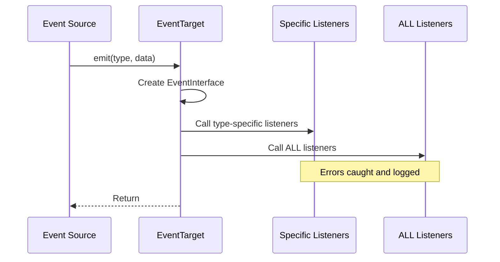

## Overview

Closure Next provides a robust event system with the `EventTarget` class and predefined `EventType` constants. This system powers component lifecycle events and enables custom event-driven architectures.

## EventTarget Class

```typescript
import { EventTarget } from '@closure/core';

class EventTarget implements EventTargetInterface {
  private listeners: Map<EventType | string, Set<(event: EventInterface) => void>>;
  private disposed: boolean;
}
```

## Constructor

```typescript
new EventTarget()
```

Creates a new event target with no parameters.

### Example

```typescript
import { EventTarget } from '@closure/core';

const target = new EventTarget();
```

## Event Types

Closure Next defines several built-in event types:

```typescript
export const EventType = {
  ALL: 'all',
  STATECHANGE: 'statechange',
  DISPOSE: 'dispose',
  TEST: 'test'
} as const;
```

<ParamField path="EventType.ALL" type="string">
  Catch-all event type that receives all events regardless of their specific type
</ParamField>

<ParamField path="EventType.STATECHANGE" type="string">
  Emitted when a component's state changes
</ParamField>

<ParamField path="EventType.DISPOSE" type="string">
  Emitted when an object is being disposed
</ParamField>

<ParamField path="EventType.TEST" type="string">
  Used for testing purposes
</ParamField>

## Event Interface

All events conform to the `EventInterface`:

```typescript
interface EventInterface {
  type: EventType | string;  // The event type
  target: EventTargetInterface;  // The object that emitted the event
  data?: any;  // Optional event data
}
```

## Adding Event Listeners

### addEventListener()

Registers an event listener for a specific event type.

```typescript
addEventListener(type: EventType | string, listener: (event: EventInterface) => void): void
```

<ParamField path="type" type="EventType | string" required>
  The event type to listen for
</ParamField>

<ParamField path="listener" type="function" required>
  Callback function that receives the event object
</ParamField>

<Note>
If the EventTarget is already disposed, the listener will not be added.
</Note>

### Example

```typescript
import { EventTarget, EventType } from '@closure/core';

const target = new EventTarget();

target.addEventListener(EventType.STATECHANGE, (event) => {
  console.log('State changed:', event.data);
});

// Listen to all events
target.addEventListener(EventType.ALL, (event) => {
  console.log('Any event:', event.type, event.data);
});
```

## Removing Event Listeners

### removeEventListener()

Unregisters an event listener.

```typescript
removeEventListener(type: EventType | string, listener: (event: EventInterface) => void): void
```

<ParamField path="type" type="EventType | string" required>
  The event type the listener was registered for
</ParamField>

<ParamField path="listener" type="function" required>
  The exact listener function to remove
</ParamField>

<Warning>
You must pass the same function reference that was used in `addEventListener()`. Anonymous functions cannot be removed.
</Warning>

### Example

```typescript
const target = new EventTarget();

// Store reference to listener
const handleChange = (event) => {
  console.log('Changed:', event.data);
};

target.addEventListener(EventType.STATECHANGE, handleChange);

// Later, remove it
target.removeEventListener(EventType.STATECHANGE, handleChange);
```

## Emitting Events

### emit()

Emits an event with optional data. This is an alias for `dispatchEvent()`.

```typescript
emit(type: EventType | string, data?: any): void
```

<ParamField path="type" type="EventType | string" required>
  The event type to emit
</ParamField>

<ParamField path="data" type="any">
  Optional data to include with the event
</ParamField>

### dispatchEvent()

Dispatches an event. Identical to `emit()`.

```typescript
dispatchEvent(type: EventType | string, data?: any): void
```

### Event Dispatch Behavior

1. Creates an `EventInterface` object with type, target, and data
2. Calls all listeners registered for the specific event type
3. Calls all listeners registered for `EventType.ALL`
4. Wraps listener execution in try-catch blocks
5. Logs errors to console if a listener throws

### Example

<Tabs>
  <Tab title="Basic Emission">
    ```typescript
    const target = new EventTarget();
    
    target.addEventListener('custom', (event) => {
      console.log('Custom event:', event.data);
    });
    
    target.emit('custom', { message: 'Hello!' });
    // Output: Custom event: { message: 'Hello!' }
    ```
  </Tab>
  
  <Tab title="Using EventType">
    ```typescript
    import { EventTarget, EventType } from '@closure/core';
    
    const target = new EventTarget();
    
    target.addEventListener(EventType.STATECHANGE, (event) => {
      console.log('State:', event.data);
    });
    
    target.emit(EventType.STATECHANGE, { count: 42 });
    // Output: State: { count: 42 }
    ```
  </Tab>
  
  <Tab title="ALL Event Type">
    ```typescript
    const target = new EventTarget();
    
    // Listen to all events
    target.addEventListener(EventType.ALL, (event) => {
      console.log(`[${event.type}]`, event.data);
    });
    
    target.emit('event1', 'data1'); // [event1] data1
    target.emit('event2', 'data2'); // [event2] data2
    target.emit(EventType.STATECHANGE, {}); // [statechange] {}
    ```
  </Tab>
</Tabs>

## Lifecycle Management

### dispose()

Cleans up the event target and removes all listeners.

```typescript
dispose(): void
```

**Behavior:**
1. Returns early if already disposed
2. Dispatches a `DISPOSE` event
3. Clears all event listeners
4. Sets disposed flag to true

### isDisposed()

Checks if the event target has been disposed.

```typescript
isDisposed(): boolean
```

**Returns:** `true` if disposed, `false` otherwise

### Example

```typescript
const target = new EventTarget();

target.addEventListener(EventType.DISPOSE, () => {
  console.log('Target is being disposed');
});

target.dispose();
// Output: Target is being disposed

console.log(target.isDisposed()); // true

// Further operations are ignored
target.emit('test', 'data'); // No effect
```

## Error Handling

The event system includes automatic error handling:

```typescript
const target = new EventTarget();

target.addEventListener('error-test', (event) => {
  throw new Error('Listener failed!');
});

target.addEventListener('error-test', (event) => {
  console.log('This listener still runs');
});

target.emit('error-test');
// Console error: Error in event listener: Error: Listener failed!
// Output: This listener still runs
```

<Note>
Errors in one listener do not prevent other listeners from executing.
</Note>

## Extending EventTarget

Create custom event-driven classes by extending EventTarget:

```typescript
import { EventTarget, EventType } from '@closure/core';

class Store extends EventTarget {
  private data: Record<string, any> = {};

  set(key: string, value: any): void {
    const oldValue = this.data[key];
    this.data[key] = value;
    
    this.emit('change', { key, value, oldValue });
  }

  get(key: string): any {
    return this.data[key];
  }
}

// Usage
const store = new Store();

store.addEventListener('change', (event) => {
  console.log(`${event.data.key} changed from`, event.data.oldValue, 'to', event.data.value);
});

store.set('user', 'Alice');
// Output: user changed from undefined to Alice

store.set('user', 'Bob');
// Output: user changed from Alice to Bob
```

## Complete Example: Custom Component

```typescript
import { EventTarget, EventType } from '@closure/core';

class Counter extends EventTarget {
  private count: number = 0;

  increment(): void {
    this.count++;
    this.emit(EventType.STATECHANGE, { count: this.count });
  }

  decrement(): void {
    this.count--;
    this.emit(EventType.STATECHANGE, { count: this.count });
  }

  getCount(): number {
    return this.count;
  }

  reset(): void {
    const oldCount = this.count;
    this.count = 0;
    this.emit('reset', { oldCount, newCount: 0 });
    this.emit(EventType.STATECHANGE, { count: this.count });
  }
}

// Usage
const counter = new Counter();

// Listen to state changes
counter.addEventListener(EventType.STATECHANGE, (event) => {
  console.log('Count is now:', event.data.count);
});

// Listen to reset
counter.addEventListener('reset', (event) => {
  console.log('Reset from', event.data.oldCount, 'to', event.data.newCount);
});

// Listen to all events
counter.addEventListener(EventType.ALL, (event) => {
  console.log('Event type:', event.type);
});

counter.increment(); // Count is now: 1 / Event type: statechange
counter.increment(); // Count is now: 2 / Event type: statechange
counter.reset(); // Reset from 2 to 0 / Count is now: 0 / Event type: reset / Event type: statechange

// Clean up
counter.dispose();
```

## Event Flow Diagram



## Best Practices

<CardGroup cols={2}>
  <Card title="Store Listener References" icon="bookmark">
    Save listener functions to variables if you need to remove them later
  </Card>
  
  <Card title="Use EventType Constants" icon="hashtag">
    Use predefined EventType constants instead of magic strings
  </Card>
  
  <Card title="Clean Up Listeners" icon="broom">
    Remove listeners or dispose targets to prevent memory leaks
  </Card>
  
  <Card title="Handle Errors" icon="shield">
    Wrap risky code in try-catch within listeners
  </Card>
</CardGroup>

## Related

- [Component Class](/core/components) - Extends EventTarget
- [State Management](/essentials/state-management) - Uses events for state changes
